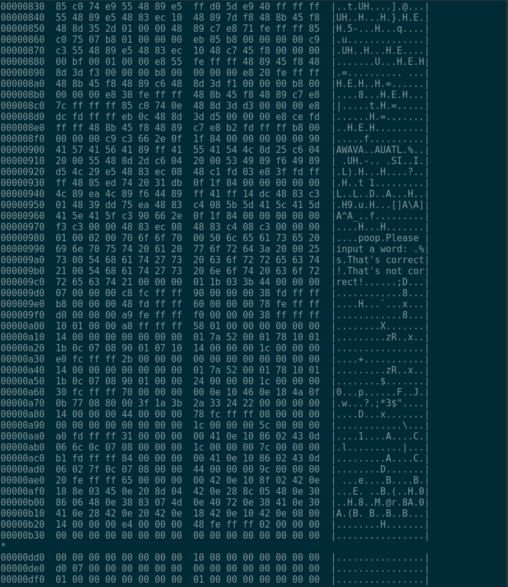
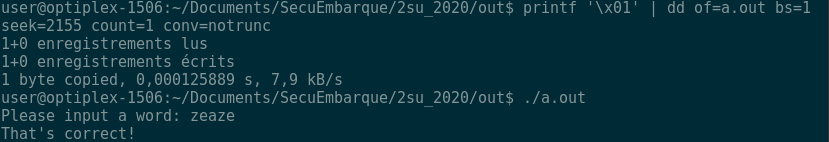

# INSA 2SU 2020

https://bitbucket.org/whitewand/2su_2020/src

# Questions
```
- Quels sont les chemins d'attaque possibles sur la signature d'un système embarqué?
- A quoi sert la chaine de confiance? Pourquoi est-elle nécessaire?
- Décrire la méthode pour aborder la sécurité sur un produit embarqué. Pourquoi établir un modèle d'attaquant est-il important?
- Trouver un moyen rapide de faire du debug embarqué (par exemple sur cible ARM)? Expliquer les avantages
- Lister les catégories de bug possibles et comment les exploiter et les défendre
- Quelles idées pour améliorer la sécurité en embarqué? (IA, Anti-debug, Obfuscation, Crypto ...) Choisissez une idée, chercher si elle existe et développer en quelques phrases quel avantage elle apporte et ses limites
```


# TD1: \[Reverse engineering\]

L'output de la commande file program> L'output est different de ce qui est sur le tutorial parce que nous sommes sur Linux Debian.


Le resultat de la commande ``` hexdump -C program | head -n 20. ``` est:


La colonne a gauche est l'offset en hexadecimal.
La deuxieme colonne est le contenu de fichier en hexadecimal
La colonne a gauche montre l'equivalent de contenu du fichier en ASCII.

L'output de la commande string
```
poop
Please input a word:
That's correct!
That's not correct!
```
On voit bien que le fichier dispose des strings et dispose le mot de passe en clair. Une obfuscation pour cacher les textes auraient été essentiel.

Avec la commande ```objdump -S -l -C -F -t -w program | less``` , on peut voit bien l'adresse de la fonction is_valide 


Les trois premières instructions sont les commandes pour déclaration d'une fonction, ils enregistrent le vieux pointeur, trouve le nouveau pointeur  et puis vide le stack.

Les 2 prochaines instructions sont pour la declaration de strcmp 

Les instructions lea et mov apres appellent la fonction strcmp 

On compare les valeur des deux strings et puis s'ils ne sont pas egaux, on passe a l'instruction 86a, et puis %eax est attribue a valeur 0x00. Si les strung sont egaux, la valeur  %eax est attribue a valeur 0x01.

Les dernieres commandes sont pour retourner le resultat et retourne a la fonction main.

On constate qu'il y a deux instructions similaires :
```
863: b8 01 00 00 00     mov $0x1, %eax
86a: b8 00 00 00 00     mov $0x0, %eax
```
Donc on veut changer le resultat de la deuxieme instruction pour qu'il attribue toujours la valeur 0x01 a %eax, donc dans deux cas %eax sont toujours attribue a 0x01, donc le resultat de la fonction is_valid est toujours 1.

Voici le resultat apres d'avoir utilise cette commande pour ecraser 0x01 au lieu de 0x00.
86a(16) = 2154(10), donc on va remplacer l'adresse 86b dont 2155 en decimal.


On peut voir que le programme est attique et il dit que c'est toujours le bon mot de passe. 

# TD2 \[Reverse engineering\]
## Binwalk
### utiliser binwalk sur vmlinuz-qemu-arm-2.6.20. Expliquer ce que vous voyez. Qu'est ce qui peut etre intéressant d'un point de vue sécurité?
J'ai extrait le fichier avec la commande ```binwalk -e nom_du_fichier``` . 
Donc Binwalk permet de voir s'il y a des fichiers caches ou compressees (qu'on peut pas voire en utilisant les commandes comm gunzip ou tar) .
On peut extraire les signatures, des fichiers executables, des cles de chiffrements. Donc l'attaquant peut eventuellement profiter de ce programme pour analyser ce genre de fichiers et trouver des informations important

### Retrouvez le pingouin de la démo qemu.
J'ai applique la commande binwalk plusieurs fois et puis parcouru tous les repertoires et chemins possible. A partir de cpio-root je n'ai plus besoin d'extraire.

Le fichier de pingouin tux.png se trouve dans le chemin suivant ```/_vmlinuz-qemu-arm-2.6.20.extracted/_31B0.extracted/E7E0.extracted/cpio-root/usr/local/share/directfb-examples/tux.png```


J'ai utilise la commande ```binwalk E7E0  ``` . On peut trouver le fichier tux.png avec les informations suivantes:
```2984412 0x2D89DC ASCII cpio archive (SVR4 with no CRC), file name: "/usr/local/share/directfb-examples/tux.png", file name length: "0x0000002B", file size: "0x00006050"```


Donc j'ai utilise la commande dd pour obtenir l'image de pengouin:

``` dd if=E7E0 skip=2984568 count=24656 of=penguin.png bs=1 ``` 
On obtient un image de pingouin. Les parametres sont obtenus a partir de :

skip = 2984568 : l'adrsse de fichier suivant (3009224) - taille fichier (24656)"

count = 24656(dec) = 0x00006050 (taille de fichier).


### Essayez de patcher le fichier pour remplacer le pingouin par une autre image. Que ce passe-t-il?    

La commande ```dd skip=2984568 count=24656 if=penguin1.png of=E7E0 bs=1 conv=notrunc``` ne marche pas.


Donc on peut pas remplacer le pengouin simplement avec la commande dd.

# TD3 \[Exploit\] Double free
## Exploitation.
On va tenter un programme simple: double_free.c
Ce programme fait 2 fois la commande free sur le pointeur a. Pour eviter l'erreur "double free corruption", on fait un free pour b entre les 2 free de a.
L'etat de fastbin est comme suivant :

'a' libere.
  ```head -> a -> tail```

'b' libere.

  ```head -> b -> a -> tail```

'a' libere encore une fois.

  ```head -> a -> b -> a -> tail```

'malloc' pour 'd'.

  ```head -> b -> a -> tail [ 'a' is returned ]```

'malloc' pour 'e'.

  ```head -> a -> tail [ 'b' is returned ]```

'malloc' pour 'f'.

  ```head -> tail [ 'a' is returned ]```
Donc on peut voir que d et f point sur le meme pointeur. On peut modifier l'autre pointeur pour avoir une execution d'une fonction d'attaque. 

## Pour se proteger de cette erreur
#### Heap Memory
Lors du développement : propreté du source (utiliser malloc/free le plus possible, utiliser les fonctions n comme strncpy pour vérifier les limites...), utilisation de librairies de développement spécialisée contre les buffers overflow 
Utiliser des logiciels spécialisés pour la vérification de code source
Choisir un langage de programmation qui n'a pas ce type d'attaque, par exempleJava.
Fiabiliser l'OS pour qu'il ne soit pas vulnérable aux débordement de buffer, par exemple : grsecurity pour Linux.

#### Double Free
Pour éviter l'exploitation de double free, il faut attribuer le pointeur a NULL le pointeur avant libérer. Quand on fait cela, il ne contient plus l'ancienne adresse et si un deuxième free arrive cela ne dommage rien car on peut pas liberer un pointeur NULL.


# TD5 : Exploitation de Dirty Cow.
J'ai cree un fichier foo avec le droit de root. Donc l'utilisateur normale (minh) ne peut pas modifier le contenu de ce fichier.

Apres avoir lance le programme Dirtycow. j'ai obtenu le resultat suivant:
```
$ gcc -pthread src/dirtyc0w.c -o /out/dirtyCow/dirtyc0w
$ ./out/dirtyCow/dirtyc0w foo m00000000000000000
mmap 56123000
madvise 0
procselfmem 1800000000
$ cat out/dirtyCow/foo
m00000000000000000
```