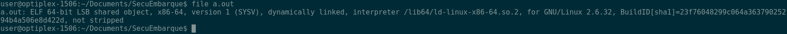
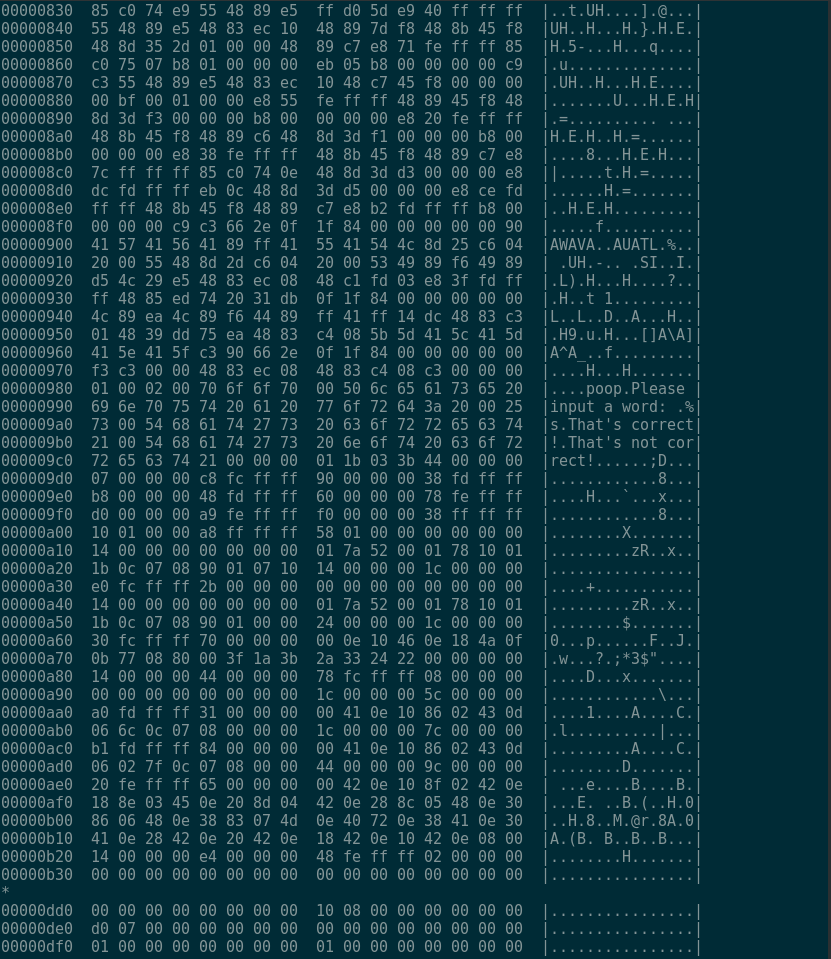
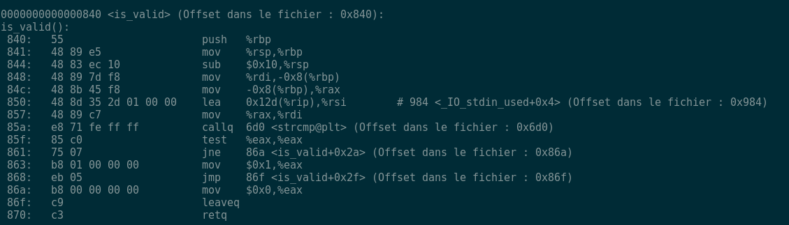
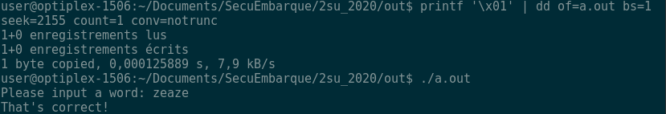

# Questions

- Quels sont les chemins d'attaque possibles sur la signature d'un système embarqué?
- A quoi sert la chaine de confiance? Pourquoi est-elle nécessaire?
- Décrire la méthode pour aborder la sécurité sur un produit embarqué. Pourquoi établir un modèle d'attaquant est-il important?
- Trouver un moyen rapide de faire du debug embarqué (par exemple sur cible ARM)? Expliquer les avantages
- Lister les catégories de bug possibles et comment les exploiter et les défendre
- Quelles idées pour améliorer la sécurité en embarqué? (IA, Anti-debug, Obfuscation, Crypto ...) Choisissez une idée, chercher si elle existe et développer en quelques phrases quel avantage elle apporte et ses limites


# TD1: \[Reverse engineering\]

Comprendre le patching de binaire

## Finir crack emily (version avec soluce)

https://archive.emily.st/2015/01/27/reverse-engineering/


// Expliquer avec vos propres mots basé sur l'[exemple suivant](https://github.com/DavidJacobson/EasyCTF-2015-writeup/blob/master/binary_exploitation.md#buffering---80-pts)


L'output de la commande file program> L'output est different de ce qui est sur le tutorial parce que nous sommes sur Linux Debian.


Le resultat de la commande ``` hexdump -C program | head -n 20. ``` est:


La colonne a gauche est l'offset en hexadecimal.
La deuxieme colonne est le contenu de fichier en hexadecimal
La colonne a gauche montre l'equivalent de contenu du fichier en ASCII.

L'output de la commande string
```
poop
Please input a word:
That's correct!
That's not correct!
```
On voit bien que le fichier dispose des strings et dispose le mot de passe en clair. Une obfuscation pour cacher les textes auraient été essentiel.

Avec la commande ```objdump -S -l -C -F -t -w program | less``` , on peut voit bien l'adresse de la fonction is_valide 


Les trois premières instructions sont les commandes pour déclaration d'une fonction, ils enregistrent le vieux pointeur, trouve le nouveau pointeur  et puis vide le stack.

Les 2 prochaines instructions sont pour la declaration de strcmp 

Les instructions lea et mov apres appellent la fonction strcmp 

On compare les valeur des deux strings et puis s'ils ne sont pas egaux, on passe a l'instruction 86a, et puis %eax est attribue a valeur 0x00. Si les strung sont egaux, la valeur  %eax est attribue a valeur 0x01.

Les dernieres commandes sont pour retourner le resultat et retourne a la fonction main.

On constate qu'il y a deux instructions similaires :
```
863: b8 01 00 00 00     mov $0x1, %eax
86a: b8 00 00 00 00     mov $0x0, %eax
```
Donc on veut changer le resultat de la deuxieme instruction pour qu'il attribue toujours la valeur 0x01 a %eax, donc dans deux cas %eax sont toujours attribue a 0x01, donc le resultat de la fonction is_valid est toujours 1.

Voici le resultat apres d'avoir utilise cette commande pour ecraser 0x01 au lieu de 0x00.
86a(16) = 2154(10), donc on va remplacer l'adresse 86b dont 2155 en decimal.


On peut voir que le programme est attique et il dit que c'est toujours le bon mot de passe. 


## Prendre un binaire de votre choix et changer son comportement

Expliquer pourquoi modifier le comportement d'un binaire peut être intéressant pour un attaquant

Les outils pour cette partie sont à votre choix

Des outils possibles:
- Ida
- Cutter / Radare2
- Ghidra

# TD2 \[Reverse engineering\]

Le pingouin dans la botte de foin

## Binwalk

install et regarder l'aide

http://www.devttys0.com/2011/05/reverse-engineering-firmware-linksys-wag120n/

https://bootlin.com/blog/qemu-arm-directfb-demo/

utiliser binwalk sur vmlinuz-qemu-arm-2.6.20

Expliquer ce que vous voyez. Qu'est ce qui peut etre intéressant d'un point de vue sécurité?

Retrouvez le pingouin de la démo qemu.

Essayez de patcher le fichier pour remplacer le pingouin par une autre image. Que ce passe-t-il?     

# TD3 \[Exploit\]

Faire un exemple d'exploitation de heap buffer overflow avec le code correspondant

ou 

Faire un exemple d'exploitation de double free avec le code correspondant

Comment peut-on s'en protéger?

# Choisissez au moins un des TDs suivants (ou plusieurs) (ou tous)

# TD4 \[Fuzzing\]

Ecrivez un fuzzer (script) sur la base du TD1 qui va modifier bit par bit le binaire jusqu'à obtenir un OK avec un mauvais mot de passe

Faire sur le range de la fonction is_valid si trop lent

# TD5 \[Exploit\]

Montrer ce qu'il est possible de faire avec la vulnérabilité [DirtyCow](https://github.com/dirtycow/dirtycow.github.io/wiki/PoCs)

# TD6 \[Side channel\]

Créer un POC montrant une timing attack sur un password par exemple

En quoi les timings attacks peuvent poser des problèmes en embarqué?

# TD7 \[CTF\]

Faire un writeup des premiers levels (3) de [Microcorruption](https://microcorruption.com/login)

# TD8 \[Compilation\]

Montrer l'effet des options de compilation sur le code

Compilez les différentes formes de code (if/switch, for/while) avec des options de compilation différentes -O2 -O3

En quoi ce peut être problématique pour la sécurité?

Comment est ce que je peux modifier l'assembleur des formes de code (if/switch, for/while) pour obtenir un comportement intéressant pour l'attaquant. Expliquez le gain.

# TD9 \[Crypto\]

Créer une signature d'un fichier avec OpenSSL

https://stackoverflow.com/questions/10782826/digital-signature-for-a-file-using-openssl

En quoi la signature peut protéger dans un contexte embarqué?

Comment protéger l'update d'un firmware?

# TD10 \[Tools\]

Jouer avec les outils suivants:
- [z3](https://yurichev.com/writings/SAT_SMT_by_example.pdf)
- [angr](https://docs.angr.io/examples)
- [afl](https://www.evilsocket.net/2015/04/30/fuzzing-with-afl-fuzz-a-practical-example-afl-vs-binutils/)

Comment est ce que je peux utiliser ces outils en tant que défenseur?

